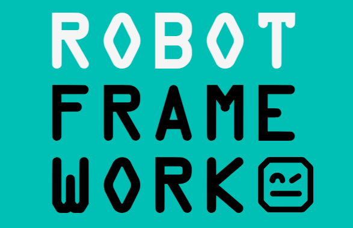

<div align="center">
</div>

# Testes automatizados usando Robot Framework com biblioteca de navegador

## 🔥 Introdução

Esse projeto tem como objetivo desenvolver testes e2e usando o [Robot Framework](https://robotframework.org/) na seguinte aplicação: https://www.saucedemo.com/

### ⚙️ Pré-requisitos

Para executar os testes é necessário ter instalado em sua máquina:

- Algum editor de código como [VS Code](https://code.visualstudio.com/) ou [PyCharm](https://www.jetbrains.com/pycharm/)
- [Python](https://www.python.org/)
- [Node.JS](https://nodejs.org/en/download) necessário para a biblioteca do navegador

### 🔨 Guia de instalação

Etapas para instalar:

1. Clone o repositório:

```bash
git clone https://github.com/Darlan0307/Robot-Tests-E2E.git
```

2: Criar e ativar ambiente virtual:

```bash
python3 -m venv venv
source venv/bin/activate # (Linux/Mac)
venv\Scripts\activate.bat # (Windows)
```

3: Instalar as dependências:

```bash
pip install -r requirements.txt
```

e depois

```bash
rfbrowser init
```

## 🛠️ Executando os testes

1. De permissão para executar o script:

```bash
chmod +x run_tests.sh
```

2. Executar os testes:

```bash
./run_tests.sh
```

No próprio terminal será exibido o resultado dos testes. Mas também será criado uma pasta com o nome "results" na raiz do projeto, com mais detalhes dos testes executados.

## 📦 Tecnologias usadas:

- Python 3.12
- Robot Framework 7.2.2
- Robot Framework Browser 19.4.0

## 👷 Autor

**Darlan Martins** - [LinkedIn](https://www.linkedin.com/in/darlan-martins-8a7956259/)
